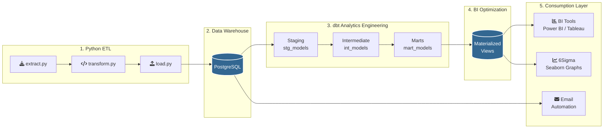

```mermaid
flowchart LR
    subgraph 1. Python ETL
        A[fa:fa-download extract.py] --> B[fa:fa-code transform.py]
        B --> C[fa:fa-upload load.py]
    end

    subgraph 2. Data Warehouse
        C --> D[(PostgreSQL)]
    end

    subgraph 3. dbt Analytics Engineering
        D --> E[Staging \n stg_models]
        E --> F[Intermediate \n int_models]
        F --> G[Marts \n mart_models]
    end

    subgraph 4. BI Optimization
        G --> H[(Materialized \n Views)]
    end

    subgraph 5. Consumption Layer
        H --> I[fa:fa-chart-bar BI Tools \n Power BI / Tableau]
        H --> J[fa:fa-chart-line 6Sigma \n Seaborn Graphs]
        D --> K[fa:fa-envelope Email \n Automation]
    end
    
    %% Estilos opcionales para que se vea mejor
    style D fill:#336791,stroke:#fff,stroke-width:2px,color:#fff
    style H fill:#336791,stroke:#fff,stroke-width:2px,color:#fff
```
